# Beleema Bank App

Beleema Bank App is a modern mobile banking application focused on **security, reliability, and transaction correctness**. It is designed to handle real‑world fintech challenges such as unstable networks, sensitive user data, and transaction‑critical workflows, while still delivering a smooth user experience.

---

## Overview

Beleema Bank App enables users to securely:

* Authenticate and manage sessions
* Set and manage transaction PINs
* Perform transaction‑sensitive actions safely
* Receive clear feedback on success and failure states

The app is built with production‑grade patterns, emphasizing **robust error handling**, **clear state management**, and **defensive coding practices**.

---

## Tech Stack

* **Framework:** Flutter
* **Architecture:** Layered / Feature‑based architecture
* **State Management:** Riverpod
* **Networking:** Dio 
* **Security:**
    * Secure PIN handling with Flutter Secure Storage
    * Encrypted network communication (HTTPS / TLS)
    * Keypad Re-engineered to prevent from keystoke attack
* **Error Handling:** Centralized error mapping with user‑friendly messages
* **Dependency Management** Riverpod

---

## Key Features

### Authentication

* Secure login flow
* Session‑aware routing (e.g., PIN‑set vs PIN‑not‑set flows)
* Network timeout and retry handling

### Transaction PIN Setup

* Dedicated transaction PIN setup screen and confirmation
* PIN validation and confirmation
* Graceful error feedback via snackbars/dedicated screen


### Transaction PIN Setup

* Secure Transaction Management
* Set and confirm a transaction PIN to authorize transfers.
* Supports biometric authentication for faster and secure access.

### Seamless Transfers

* Enter account number and amount to transfer funds.
* Transfer summary confirmation before final submission.
* Real-time transaction status with success or error feedback.

### Dashboard Overview

* View account balance and recent transactions.
* Toggle balance visibility for privacy.
* Quick shortcuts for common actions.

### State Management & Error Handling

* Riverpod-powered notifier architecture ensures consistent state updates.
* Handles errors gracefully with Snackbars and dedicated error screens.
* Loading states and skeleton views for smoother UI experience.

### Secure API Integration

* Token-based authentication with auto-login/logout handling.
* Handles 401 Unauthorized responses globally and navigates safely to login.
* Supports retrying failed transfers without duplicating requests (demo).

### Intuitive UX

* PIN input with shake animation on invalid entry.
* Formatted amount input prevents invalid decimals or non-numeric entries.
* Responsive bottom sheets for PIN entry and transfer confirmation.

### Extensible Architecture

* Clear separation of UseCases, Repository, Providers, Notifiers, and Screens.
* Easy to extend for additional features like recurring transfers, bill payments, or multi-account support

---

## Project Structure

```
lib/
├── core/
│ ├── network/ # Dio client & interceptors
│ ├── security/ # Secure storage utilities
│ ├── utils/ # Helpers (snackbars, formatters)
│ ├── widgets/ # Reusable UI components
│ ├── config/ # app configurations
│ ├── theme/ # multile theme impl
│ └── navigation/ # Reusable UI components
├── features/
│ ├── auth/
│ │ ├── data/
│ │ ├── domain/
│ │ └── presentation/
│ │
│ ├── transaction_pin/
│ │ ├── data/
│ │ ├── domain/
│ │ └── presentation/
│ │
│ └── dashboard/
│ ├── data/
│ ├── presentation/
│ └── widgets/
│ │
│ └── transfer/
│ ├── data/
│ ├── presentation/
│ └── widgets/
│
└── main.dart
└── app.dart
```

This structure promotes:

* Feature isolation
* Easier testing
* Long‑term maintainability
---

##  Error Handling Philosophy

Errors are treated as **first‑class citizens**:

* API errors are mapped into domain‑specific failures
* UI displays actionable, human‑readable messages
* Unknown errors are safely caught and logged

This ensures users are never left confused during critical flows.

---

##  Navigation Logic

* Navigation decisions are state‑driven:
* Users without a transaction PIN are routed to PIN setup
* Authenticated users resume from their last valid state
* Invalid sessions trigger safe logout flows

---

## Setup & Installation

1. Clone the repository

   ```bash
   git clone https://github.com/abulrasheedilori/beleema_bank_app
   ```

2. Install dependencies

   ```bash
   flutter pub get
   ```

3. Run the app

   ```bash
   flutter run
   ```

---

## Design Principles

* **Correctness over convenience**
* **Fail loudly, recover gracefully**
* **Security is non‑negotiable**
* **User trust comes first**

---

##  Status

The app is under active development and continuously evolving to support more advanced banking features.

---

##  Author

Built and maintained by a mobile engineer passionate about **fintech reliability**, **secure systems**, and **production‑ready mobile applications**.

---

##  License

This project is proprietary and intended for internal or private use unless stated otherwise.


## LIMITATION

Implementation is limited to the provided endpoints and the requirements.

## Security Enhancement

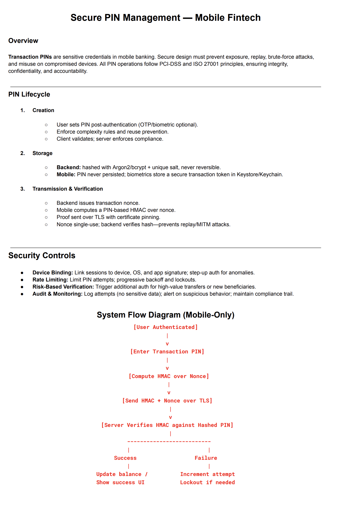

### Mobile Screenshots
----------------------------

## Splash screen

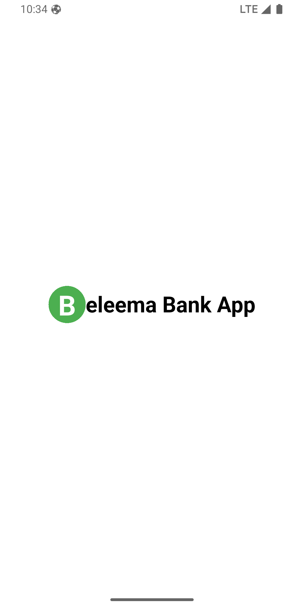

##--- Screen 2 ---
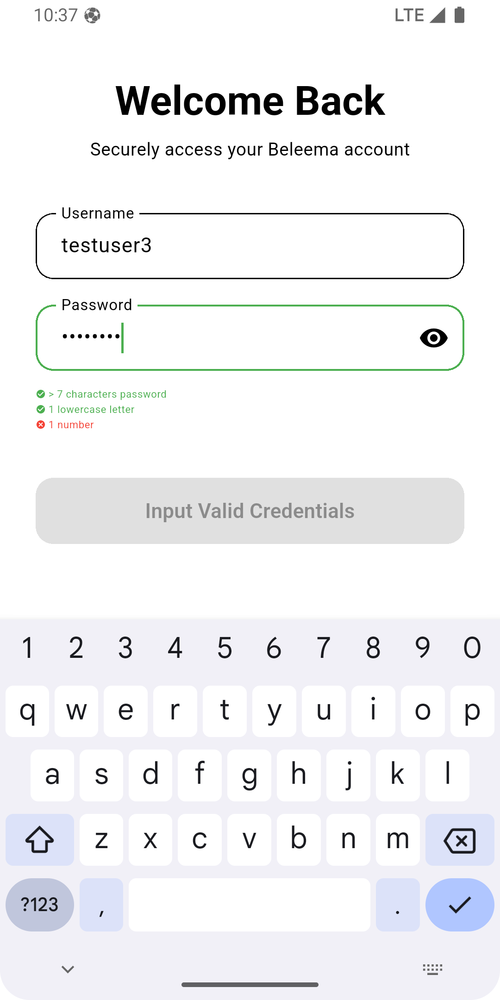

##--- Screen 3 ---

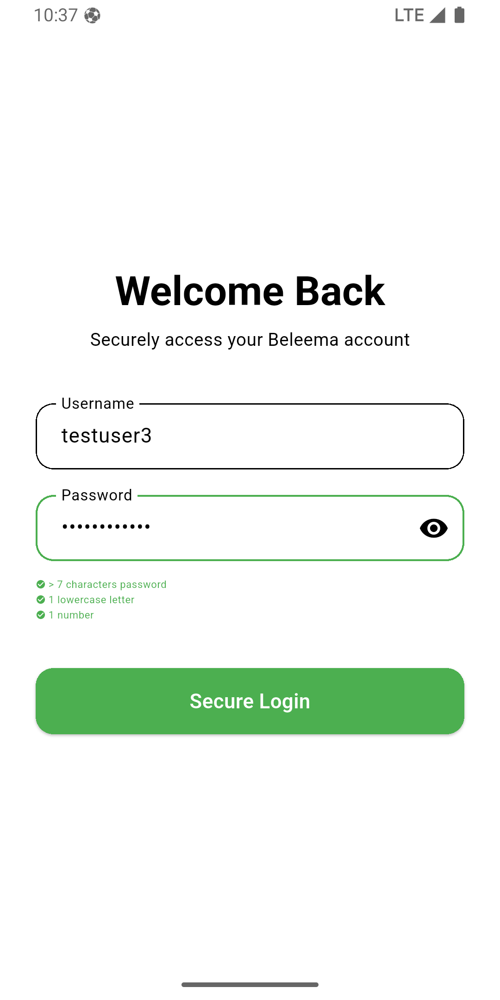

##--- Screen 4 ---


##--- Screen 5 ---

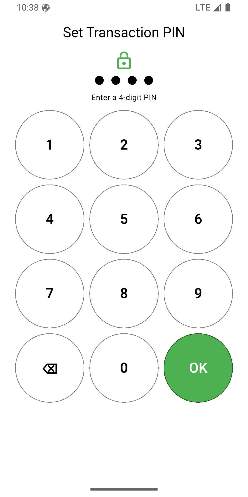

##--- Screen 6 ---

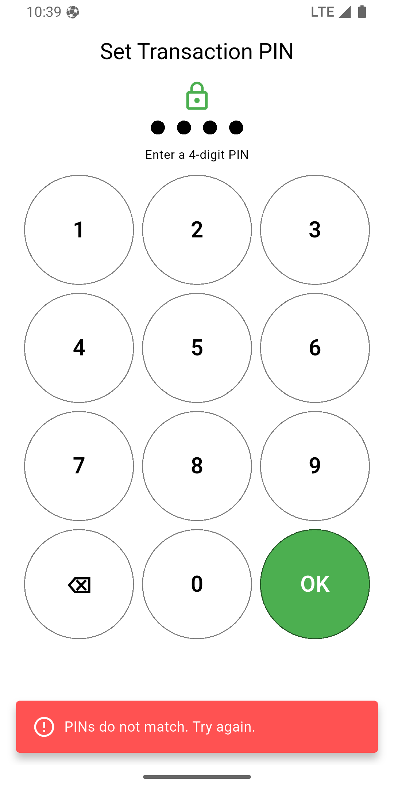

##--- Screen 7 ---


##--- Screen 8 ---

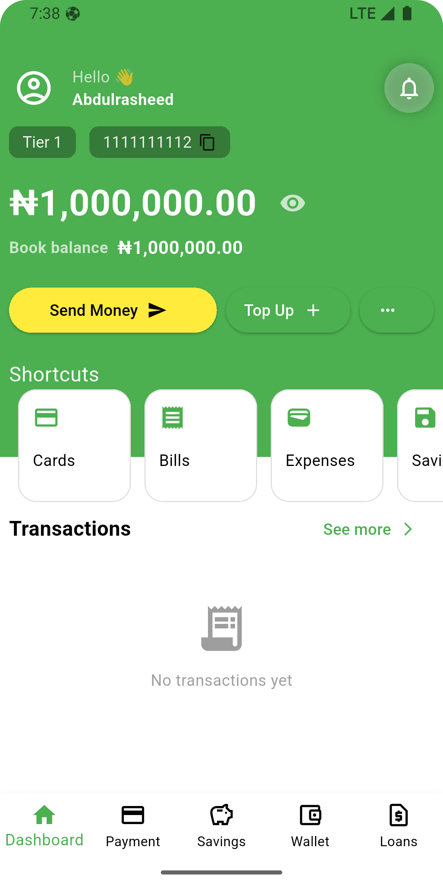

##--- Screen 9 ---

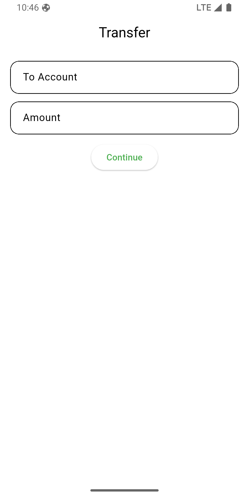

##--- Screen 10 ---

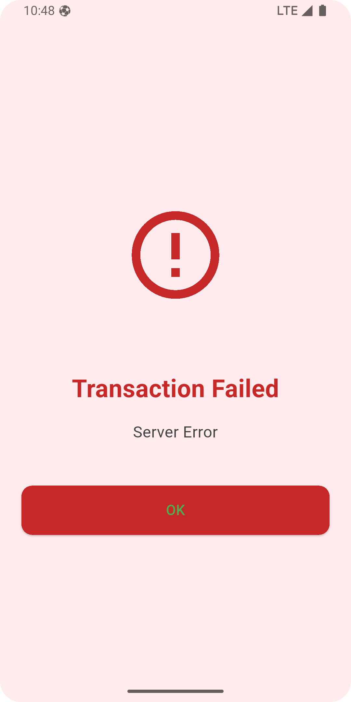

##--- Screen 11 ---

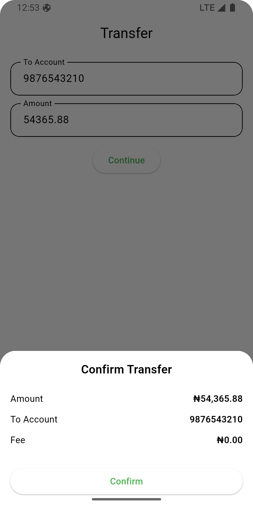

##--- Screen 12 ---

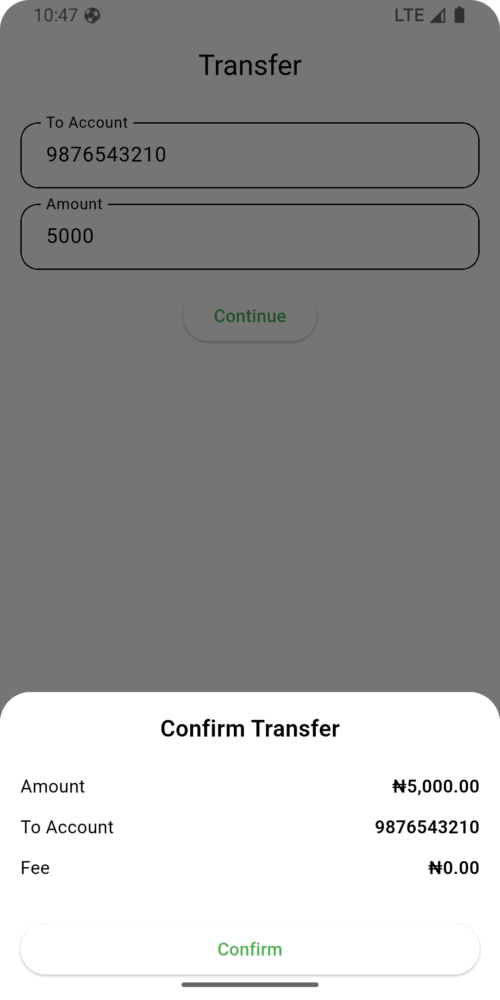

##--- Screen 13 ---

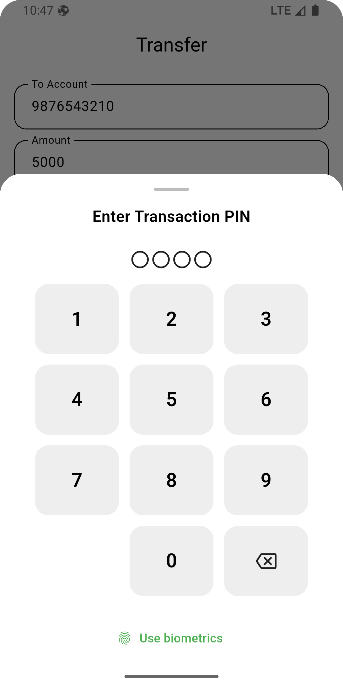

##--- Pin Security Enhancement ---


## Mobile Video Demo Link

[View App Demo](https://drive.google.com/file/d/1OvxV-xSipnUeycdYsMvrxPA43typ0IsZ/view?usp=drivesdk)
